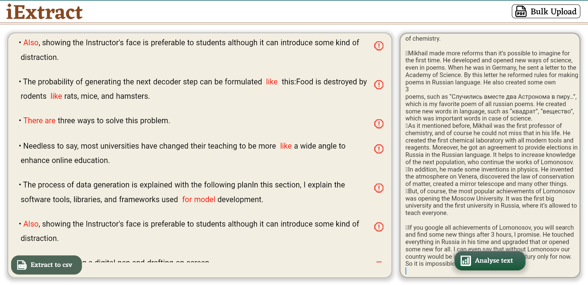

# FixMyEnglish_Group1
---

## Project Description
This is a web-app, which helps users to find and fix Academic-Writing mistakes. The project is created on Flutter, Dart. Users can upload pdf files with the essays or write text and then the app sends the list of mistakes, where users can understand, where are each mistakes, which sentence contains mistakes and how to fix these mistakes.

The repository contains a code base.

---

## Getting start
You can go to the --link-- and firstly try to use it. The main page contains a text field, where you can add some text and try to fix it.

After clicking the "fix" button, you will see the list of mistakes in the text. These mistakes may also be fixed, and the app will tell you how to do it.

Another option is to click the "Upload" button. This will transfer you to the next page, where there is a list of files you uploaded on the right and the mistakes on some files on the left.

---

## Requirements
Dart 2.17, Flutter 3

---

## Installation

1) Open the Flutter app
2) Clone the repository
3) You are ready to work!

---

## Optional information
This project was created by 6 students of the Innopolis University.
If you have any suggestions/questions, you can contact with us in GitHub.

